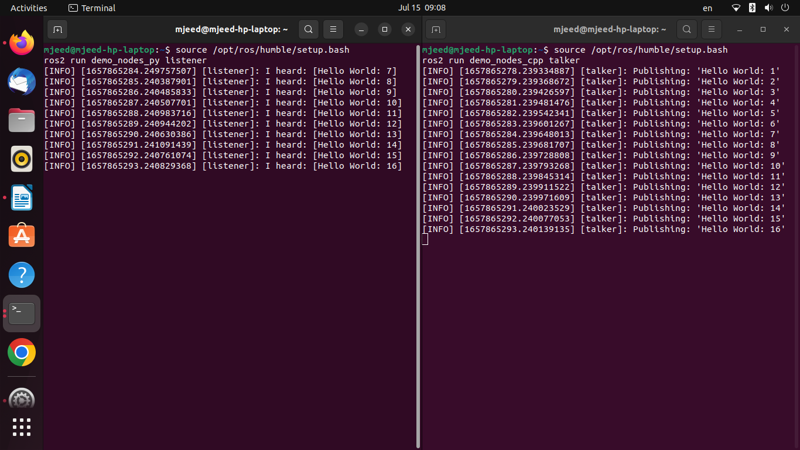

# AI Task 1 & 2
This project describes the steps I followed to install Ubuntu linux and ROS on my device and on Jetson Nano.


## Table of Contents
* [TASK 1: Ubuntu and ROS Installation on My Device](#task-1-ubuntu-and-ros-installation-on-my-device)
* [1.1 Installing Ubuntu 22.04 LTS](#1)
* [1.2 Installing ROS 2 Humble Hawksbill](#2)
* [TASK 2: XUbuntu and ROS Installation on Jetson Nano](#task-2-xubuntu-and-ros-installation-on-jetson-nano)
* [2.1 Installing XUbuntu 20.04 LTS](#3)
* [2.2 Installing ROS 2 Foxy Fitzroy](#4)


## TASK 1: Ubuntu and ROS Installation on My Device


<a name= "1"></a>
## 1.1 Installing Ubuntu 22.04 LTS

### Step 1
First, I have installed a second drive (SSD) to take advantage of the Dual-Booting.
### Step 2
Then I downloaded Ubuntu 22.04 LTS and Etcher.
### Step 3
Using Etcher, I installed Ubuntu on a USB flash drive.
### Step 4
After creating a bootable USB flash drive, I restart the computer, then I chose to boot from the USB drive.
### Step 5
Finally, the installation window appeared, and Ubuntu has been installed successfully.


<a name= "2"></a>
## 1.2 Installing ROS 2 Humble Hawksbill
- I installed Humble Hawksbill release because it supports ubuntu 22.04, unlike Noetic Ninjemys release which does not.
- By copying the commands from the Debian packages on the official website (https://www.ros.org/) and pasting them into the ubuntu terminal,  ROZ 2 installation was successful.

### Set local
Making sure I have a locale that supports `POSIX`.
```
locale  # check for UTF-8

sudo apt update && sudo apt install locales
sudo locale-gen en_US en_US.UTF-8
sudo update-locale LC_ALL=en_US.UTF-8 LANG=en_US.UTF-8
export LANG=en_US.UTF-8

locale  # verify settings
```
### Setup Sources
Enable the Ubuntu Universe repository
```
sudo apt install software-properties-common
sudo add-apt-repository universe
```
Authorize the GPG key with apt.
```
sudo apt update && sudo apt install curl gnupg lsb-release
sudo curl -sSL https://raw.githubusercontent.com/ros/rosdistro/master/ros.key -o /usr/share/keyrings/ros-archive-keyring.gpg
```
Adding the repository to the sources list.
```
echo "deb [arch=$(dpkg --print-architecture) signed-by=/usr/share/keyrings/ros-archive-keyring.gpg] http://packages.ros.org/ros2/ubuntu $(source /etc/os-release && echo $UBUNTU_CODENAME) main" | sudo tee /etc/apt/sources.list.d/ros2.list > /dev/null
```
### Install ROS 2 packages
Updating the apt repository caches after setting up the repositories.
```
sudo apt update
```
Desktop Install: ROS, RViz, demos, tutorials.
```
sudo apt install ros-humble-desktop
```
### Environment setup
Set up the environment by sourcing the following file.
```
source /opt/ros/humble/setup.bash
```
### Trying some examples
In one terminal, source the setup file and then run a C++ `talker`:
```
source /opt/ros/humble/setup.bash
ros2 run demo_nodes_cpp talker
```
In another terminal source the setup file and then run a Python `listener`:
```
source /opt/ros/humble/setup.bash
ros2 run demo_nodes_py listener
```
### Result:



## TASK 2: XUbuntu and ROS Installation on Jetson Nano
Actually, this task is very similar to task 1 because, in the first task, I preferred to install Ubuntu on a second drive rather than VM, which makes the two tasks very similar. However, there are minor differences that I will mention below.

<a name= "3"></a>
## 2.1 Installing XUbuntu 20.04 LTS

### Step 1
We will download (Xubuntu 20.04 Focal Fossa L4T R32.3.1) instead of Ubuntu because it is a custom image for the Jetson Nano.
### Step 2
Using Etcher, we will flash the image on a micro SD card throgh SD Card Reader USB.
### Step 3
- If our Jetson Nano was A02 then we should plug in the SD card, and after its booting, it will take us to the XUbuntu installation screen.

  To find out which .dtb file is compatible with our Jetson Nano run the following on the it:

  ``cat /sys/firmware/devicetree/base/compatible
  ``

- In case of the Jetson Nano was B01, then from our SD card we should go to boot > extlinux > extlinux.conf then open it in terminal
  and enter the command:
  ``sudo vim extlinux.conf
  ``

  then add this line and save the file:
  ``FDT /boot/tegra210-p3448-0000-p3449-0000-b00.dtb
  ``

  Finally we plug in the SD card, and after booting, it will take us to the XUbuntu installation screen.

<a name= "4"></a>
## 2.2 Installing ROS 2 Foxy Fitzroy
In the same way that we installed ROS Humble Hawksbill previously, we can install Foxy Fitzroy; by copying the commands from the Debian packages on the official website and pasting them into the Xubuntu terminal.
